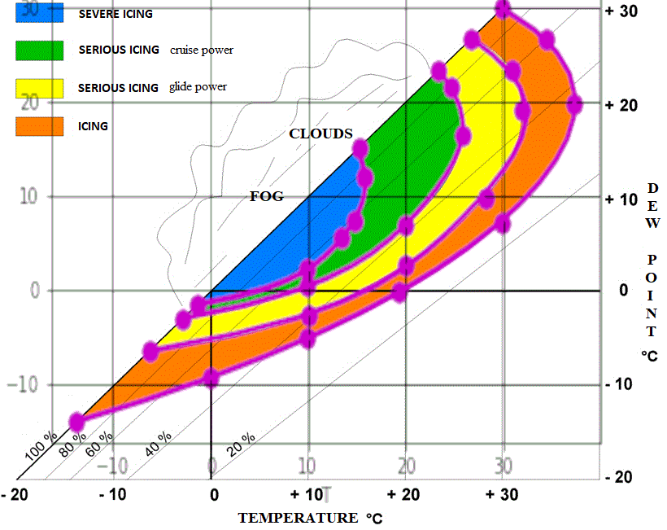

# Aero Engines | Aviation | Quickstarts

## Carburator Icing
### Chart Data Points
- 
- [Curve Fitting in Excel (With Examples) | Statology](https://www.statology.org/curve-fitting-in-excel/) - To get the numbers from a graph
- [Polynomial polyfit | NumPy](https://numpy.org/doc/stable/reference/generated/numpy.polynomial.polynomial.polyfit.html)

> Still in the works.



The data points: 

```python
[19.634  1.688 -0.044  0.    -0.    -0.   ]
[ 1.5896e+01  1.9160e+00 -1.4600e-01  1.1000e-02 -0.0000e+00  0.0000e+00]
[ 8.797e+00  2.878e+00 -3.080e-01  2.400e-02 -1.000e-03  0.000e+00]
[ 4.955e+00  3.183e+00 -5.500e-01  6.500e-02 -4.000e-03  0.000e+00]
```

Code used: 

```python
for a in [c1,c2,c3,c4]:

    # Unpack input array
    dp, t = a[:,0], a[:,1]

    # Coeffs - Low to high power
    c = npp.polyfit(dp, t, deg=5)
    print(np.round(c, 3))

    # Curve samples
    dp_s = np.linspace(dp[0], dp[-1], 20)
    t_s = npp.polyval(dp_s, c)
    
    # Plot everything
    ax.plot(t_s, dp_s, c='m', lw=3) # samples
    ax.scatter(t, dp, c='m', s=90) # input points
```


```python
c1 = np.array([[-13.9, -13.7],
               [-9.2,  -0.],
               ...
```

Since the original functions are not injective (folded curves), the polynomials are the inverse functions, they take the dew point as the variable, and return the temperature: 
```math
t=p(dp)
```

Source: 
- [What are the Cessna 172 carburetor icing chart data points? | Aviation | StackExchange](https://aviation.stackexchange.com/questions/104108/what-are-the-cessna-172-carburetor-icing-chart-data-points)
Credit: 
- [mins](https://aviation.stackexchange.com/users/3201/mins)

## Documents
- [Aircraft Carburettor Icing Studies | LR-536 | Mechanical Engineering Report | National Research Council Of Canada | LR-536.pdf](./Documents/LR-536.pdf) - Authors: L. Gardner and G. Moon (Devision Of Mechanical Engineering). Ottawa July 1970. NRC NO. 11621
- [Aircraft Systems | Chapter 7 | ...](./Documents/09_phak_ch7.pdf)
- [Icing-Protection Requirements For Reciprocating-Engine Induction Systems | Technical Note 1993 | National Advisory Committee For Aeronautics](./Documents/19930082741.pdf) - Authors: Willard D. Coles, Vern G. Rollin and Donald R. Mulholland. Lewis Flight Propulsion Laboratory Cleveland, Ohio. (NACA). Washingtion December 1949.
- [Safety Recommendation | Washington, D.C. 20594 | National Transportation Safety Board](./Documents/900108NtsbRecCarbHeat.pdf) - Honorable James B. Busey. Administrator: Federal Aviation Administration Washington, D.C. 20591. Date: January 8, 1990. In reply refer to: A-89-140 through -142.
- [Light Aircraft Piston Engine Carburator Ice Detector/Warning Device Sensitivity/Effectiveness (AD A117745) (DOT/FAA/CT-82/44)](./Documents/ADA117745.pdf) - Authors: William Cavage, James Newcomb and Keith Biechi. Date: June 1982. (Final Report)
- [Piston Engine Icing | EGAST - Component of ESSI | European General Aviation Safety Team](./Documents/EGAST_GA5-Piston-Engine-Icing-final.pdf) - For general aviation pilot (safety promotion leaflet) (GA 5). Web: http://easa.europa.eu/essi/egast/
- [Engine Performance Comparison Associated with Carburetor Icing During Aviation Grade Fuel and Automotive Grade Fuel Operation (DOT/FAA/CT-82/110)](./Documents/ct82110.pdf) - Authors: William Cavage, James Newcomb and Keith Biehl. Date: May 1983. Final Report.
- [Carburettor Icing-probability | Technical Report 04-25 | Danish Meteorological Institute](./Documents/tr04-25a.pdf)
  - Source: https://www.dmi.dk/fileadmin/user_upload/Rapporter/TR/2004/tr04-25a.pdf
- [Failsafe Fuel Delivery | CPS](./Documents/Part41.pdf)
  - Source: https://www.cps-parts.com/cps/pdf/Part41.pdf
- [Of Which Powerplant Is Best For Your Kitplane | CPS](./Documents/Part42.pdf)
  - Source: https://www.cps-parts.com/cps/pdf/Part42.pdf
- [Automated Engine Monitoring | CPS](./Documents/Part43.pdf)
  - Source: https://www.cps-parts.com/cps/pdf/Part43.pdf
- [Carb Ice: The Threat And The Theory | CPS](./Documents/Part44.pdf)
  - Source: https://www.cps-parts.com/cps/pdf/Part44.pdf
- [The Pros and Cons of Oil Injection | CPS](./Documents/Part45.pdf)
  - Source: https://www.cps-parts.com/cps/pdf/Part45.pdf
- [The Stealth Rotax | CPS](./Documents/Part46.pdf)
  - Source: https://www.cps-parts.com/cps/pdf/Part46.pdf
- [Rotax Piston Maintenance | CPS](./Documents/Part47.pdf)
  - Source: https://www.cps-parts.com/cps/pdf/Part47.pdf
- [Rotax Exhaust Alternative | CPS](./Documents/Part48.pdf)
  - Source: https://www.cps-parts.com/cps/pdf/Part48.pdf
- [Utilizing the Ducati Generator Output | CPS](./Documents/Part49.pdf)
  - Source: https://www.cps-parts.com/cps/pdf/Part49.pdf
- [Curing Rotary Valve Shaft Problems | CPS](./Documents/Part50.pdf)
  - Source: https://www.cps-parts.com/cps/pdf/Part50.pdf
- [Rotax Online Warranty Registration | CPS](./Documents/Part51.pdf)
  - Source: https://www.cps-parts.com/cps/pdf/Part51.pdf
- [Rebuilding the Bing Carb | CPS](./Documents/Part52.pdf)
  - Source: https://www.cps-parts.com/cps/pdf/Part52.pdf
- [Fuel Pump Maintenance | CPS](./Documents/Part53.pdf)
  - Source: https://www.cps-parts.com/cps/pdf/Part53.pdf
- [Gear Box Maintenance | CPS](./Documents/Part54.pdf)
  - Source: https://www.cps-parts.com/cps/pdf/Part54.pdf
- [C & E Gearbox Maintenance – Basic Teardown & Inspection | CPS](./Documents/Part55.pdf)
  - Source: https://www.cps-parts.com/cps/pdf/Part55.pdf
- [ C & E Gearbox Maintenance - Changing Gears & Propshaft | CPS](./Documents/Part56.pdf)
  - Source: https://www.cps-parts.com/cps/pdf/Part56.pdf
- [Rotax Storage and Water Damage | CPS](./Documents/Part57.pdf)
  - Source: https://www.cps-parts.com/cps/pdf/Part57.pdf
- [Troubleshooting the Ducati Ignition | CPS](./Documents/Part58.pdf)
  - Source: https://www.cps-parts.com/cps/pdf/Part58.pdf
- [Diagnostic Leak Testing | CPS](./Documents/Part59.pdf)
  - Source: https://www.cps-parts.com/cps/pdf/Part59.pdf
- [Using Choke in Carburetor Tuning | CPS](./Documents/Part60.pdf)
  - Source: https://www.cps-parts.com/cps/pdf/Part60.pdf
- [What to Know about Prop Strikes | CPS](./Documents/Part61.pdf)
  - Source: https://www.cps-parts.com/cps/pdf/Part61.pdf
- [Proper Crankshaft Evaluation | CPS](./Documents/Part62.pdf)
  - Source: https://www.cps-parts.com/cps/pdf/Part62.pdf
- [Certified Rotax Service Training | CPS](./Documents/Part63.pdf)
  - Source: https://www.cps-parts.com/cps/pdf/Part63.pdf
- [Engine Power Loss Due to Carburetor Icing | Safety Alert | NTSB](./Documents/SA-029.pdf)
  - Source: https://www.ntsb.gov/Advocacy/safety-alerts/Documents/SA-029.pdf

## Resources
- [Take Five: Carburetor Icing (TP 2228E - 38) | TC - Canada](https://tc.canada.ca/en/aviation/publications/take-fivefor-safety-tp-2228/take-five-carburetor-icing-tp-2228e-38)
- [Don't Let Carburetor Ice Happen To You | boldmethod](https://www.boldmethod.com/learn-to-fly/aircraft-systems/dont-let-carb-ice-happen-to-you/)
- [Carburettor Icing Probability Chart](https://www.casa.gov.au/sites/default/files/2022-10/carburettor-icing-probability-chart.pdf)
- [Carburetor Icing: Part II, Symptoms and Remedies](http://www.principalair.ca/article%20-%20icing2.htm)
- [Icing | weather.gov](https://www.weather.gov/source/zhu/ZHU_Training_Page/icing_stuff/icing/icing.htm)
