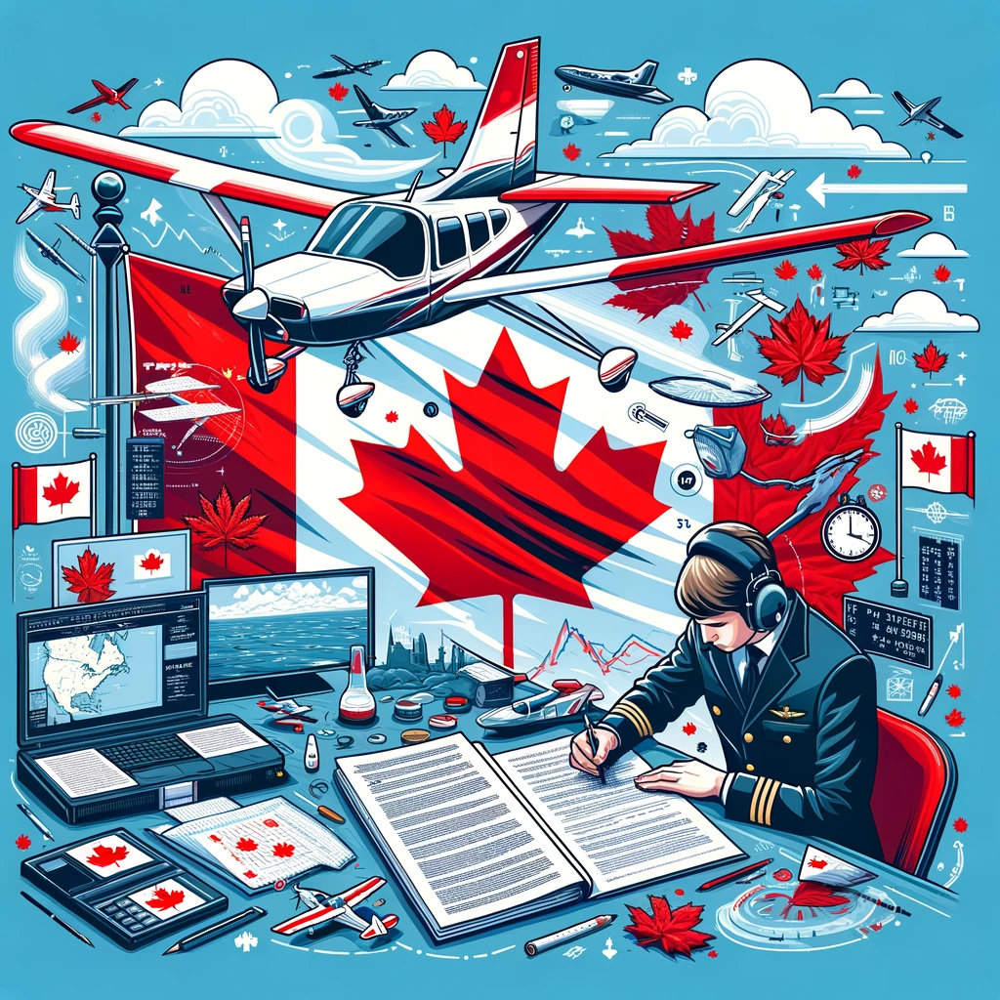

# PPL | Canadian | Exams | Aviation | Quickstarts

## General
### Examination Prerequisites
For: 
- Before written exam (respect to CAR 401.13(1))

Needed: 
- medical fitness;
- identification
  - Driver's licence
  - Passport
- a recommendation from the flight instructor who is responsible for the training the applicant; and
- experience
  - >=45h
  - Long nav (with stamps)
  - show & tell of wind affect (only instructor)

#### Materials Required
- Pencil :pencil2:
- Electronic calculator
- Navigation tools: 
  - Ruler/scale
  - Protractor
  - Flight computer

**Not approved:**
- Computers capable of storing text

> **!WARNING!** Only allowed to use the devices (flight computer) listed here: https://tc.canada.ca/en/aviation/licensing-pilots-personnel/flight-crew-licences-permits-ratings/accepted-electronic-computers-flight-crew-examinations

#### Time Limits
...

#### Rewriting Of Examinations
**CAR 400.04 (1)**

## Documents
- Study and Reference Guide for written examinations for the Private Pilot Licence - Aeroplane
  - [Transport Canada | Canada](https://tc.canada.ca/en/aviation/publications/study-reference-guide-written-examinations-private-pilot-licence-aeroplane-tp-12880)
  - [PDF](https://tc.canada.ca/sites/default/files/migrated/tp12880e.pdf) - Still from TC
