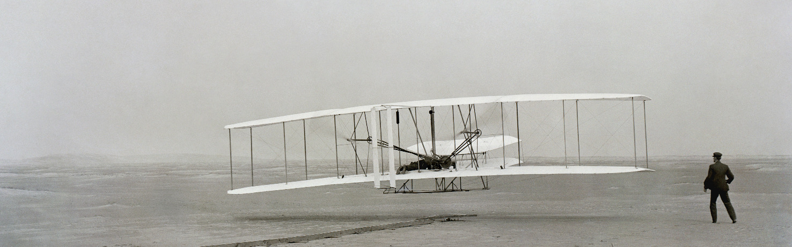

# Aviation | Quickstarts
Aviation quickstarts! (nothing is quick here 😉)

## Resources
- [LiveATC.net](https://www.liveatc.net/)
- [ADS-B Exchange - tracking thousands of aircraft](https://globe.adsbexchange.com/)
- YouTube channels: 
  - [Free Pilot Training](https://www.youtube.com/@FreePilotTraining)
### Linux
- [GNU/Linux Aviation HOWTO | The Linux Documentation Project](https://tldp.org/HOWTO/html_single/Aviation-HOWTO/)
- [Linux Aviation HOWTO: Soaring Software](http://www.ibiblio.org/fplan/Aviation-HOWTO/Aviation-HOWTO-9.html)
- [fplan](http://www.ibiblio.org/fplan/)
### Simulators
- [FlightGear](http://www.flightgear.org/) (GNU General Public License)
- [X-Plane](http://x-plane.com/)
- [JSBSim](http://jsbsim.sourceforge.net/)
### Practice tests
- [nizus: Online practice for pilot theoretical examinations](https://www.nizus.com/en)
- [Civil Aviation Sample Examination - Recreational Pilot Permit and Private Pilot Licence - Aeroplane - TP 13014 | tc.canada.ca](https://tc.canada.ca/en/aviation/publications/civil-aviation-sample-examination-recreational-pilot-permit-private-pilot-licence-aeroplane-tp-13014)
    - [Student Pilot Permit or Private Pilot Licence for Foreign and Military Applicants, Aviation Regulations - TP 11919 | tc.canada.ca (Looks like it's for the PSTAR)](https://tc.canada.ca/en/aviation/publications/student-pilot-permit-private-pilot-licence-foreign-military-applicants-aviation-regulations-tp-11919)
#### PSTAR
- [Improved PSTAR Study Guide - Robyn's Flying Start](https://www.flyingstart.ca/FlightTraining/PSTAR/PSTARIndex.htm)
- [Student Pilot Permit or Private Pilot Licence for Foreign and Military Applicants, Aviation Regulations - TP 11919](https://tc.canada.ca/en/aviation/publications/student-pilot-permit-private-pilot-licence-foreign-military-applicants-aviation-regulations-tp-11919)
- [www.principalair.ca | PSTAR Table of Contents](https://www.principalair.ca/pstar_table_of_contents.htm)
