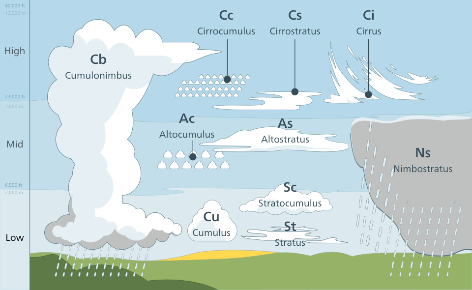

# Weather | Aviation | Quickstarts

## Clouds
### Cloud types

> The list of cloud types groups all genera as high (cirro-, cirrus), middle (alto-), multi-level (nimbo-, cumulo-, cumulus), and low (strato-, stratus).
*Source: https://en.wikipedia.org/wiki/List_of_cloud_types*

#### Cumulonimbus
Also refered as: 
- thunderheads

##### Etymology: 
From the Latin words: 
- *cumulus*: "heaped"
- *nimbus*: "rainstorm"

##### Aspects
###### Qualities:
- dense
- towering vertical

###### Forming:
- from *water vapor* carried by powerful upward air currents
- can form alone or along cold front [squall lines](https://en.wikipedia.org/wiki/Squall_line)

###### Produce:
- can produce lightning
- other dangerous sever weather
   - tornadoes
   - hailstones
   - and more...

## Resources
- [UBC ATSC 113 - Cloud Coverage](https://www.eoas.ubc.ca/courses/atsc113/flying/met_concepts/01-met_concepts/01c-cloud_coverage/index.html)
- [AWWS - Weather code and symbols legend](https://flightplanning.navcanada.ca/cgi-bin/CreePage.pl?Langue=anglais&NoSession=NS_Inconnu&Page=wxsymbols&TypeDoc=wxsymb)
- [Cloud Types [img]](https://i.imgur.com/apMxFFz.jpg)
- Videos: 
  - [Cloud Type | Youtube Video](https://www.youtube.com/watch?v=oVkECR387gQ)
  - [Weather BASICS explained (EASY to Understand) PPL Lesson 39 | Youtube Video](https://www.youtube.com/watch?v=A4eIGJrntXg)
